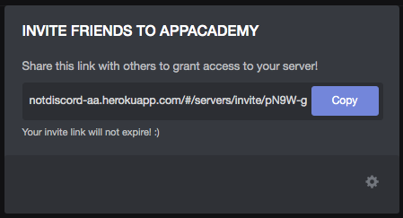
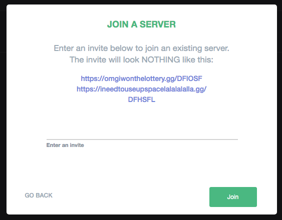
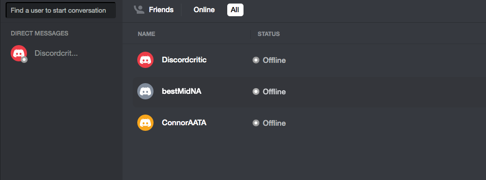

# notDiscord

notDiscord is a full stack single page messaging application inspired by 
Discord. notDiscord was implemented with React and Redux for its frontend and
Ruby on Rails for its backend. 

## Link to live site

https://notdiscord-aa.herokuapp.com/#/

## Technologies Used

* React 16.8.6 / Redux 4.0.1 (frontend)
* Ruby on Rails 5.2.3 (backend)
* PostgreSQL 2.2.2 (database)
* Heroku (server)

## Features

* User Authentication

    Users are required to sign up with a username, email, and password to 
    access the app's features. A demo user login feature is available for those 
    who want to try out the site first.

* Servers

    Users have access to different servers. A server can be made by any user 
    who then becomes its administrator. Only administrators can edit, delete, 
    or share the server's invitation link, which is available via right click. 

    

    The invitation link, although only initially accessible by the admin, can 
    be shared with anybody once the admin reveal the information. It is a 
    unique key of characters unique to each server which allows any user to 
    join a server when posted into the 'Join Server' modal. This feature was 
    implemented using custom routes in the backend.

    

* Channels

    Channels within servers contain chatrooms for server members to communicate.
    Anyone within a server can create new channels. The live-chat feature was 
    done using Ruby on Rail's Action Cable and Redis to manage web-socket 
    connections.

* Friends / Direct Messages

    Besides chatting on channels, users can also create private chatrooms for 
    direct messaging with friends. A search bar on the home page can be used to
    find other users and add them as friends. After doing so, a user will be 
    able to see their friends listed and also be able to send them a direct 
    message. Receivers of a direct message get them in real time.

    

* Online Presence

    The online/offline circle along with other features that required real-time
    information were also done using Ruby on Rail's Action Cable. An online 
    channel subscribes users as soon as they log in and unsubscribes them when 
    they log out. Statuses of the user were switched in the backend during 
    these processes which enabled others to see their online status in real 
    time. The direct message channel also broadcasted information to this 
    channel to update the presence of a new message in real time.

    ```Ruby
    class OnlineChannel < ApplicationCable::Channel
        def subscribed
            stream_for 'online_channel'
            user = User.find_by(id: params[:currentUserId])
            user.inserver
            socket = { id: user.id, email: user.email, username: user.username, 
            online: user.online }
            OnlineChannel.broadcast_to('online_channel', socket)
        end

        def unsubscribed
            stream_for 'online_channel'
            user = User.find_by(id: params[:currentUserId])
            user.leaveserver
            socket = { id: user.id, email: user.email, username: user.username, 
            online: user.online }
            OnlineChannel.broadcast_to('online_channel', socket)
        end
    end
    ```

    "user.inserver" and "user.leaveserver" are built in methods in the backend
    that switch the online status of the user.   

## Future Features

* Update search feature for optimization using SQL queries in the backend
* Hosting images on AWS to allow more diverse user avatars
* Implement pending feature for friend requests
* Create modal for confirmation on deletion of servers and channels
* Add voice channel


